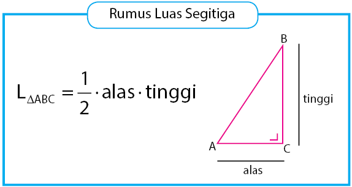

# Algoritma & Pseudocode

## TH / Animation

Walaupun algoritma bisa dibilang jantung ilmu komputer atau informatika, tetapi jangan beranggapan bahwa algoritma selalu identik dengan ilmu komputer saja. **Dalam kehidupan sehari-hari, terdapat banyak proses yang dinyatakan dalam suatu algoritma**. Misal cara memasak mie, cara membuat kue, dan lainnya.

Jika kita buat algoritma memasak mie akan seperti di bawah ini:

- Siapkan 1 bungkus mie instan, 400 ml air (2 gelas), panci, mangkok, sendok, dan garpu
- Masukkan 400 ml air kedalam panci
- Masak air
- Tunggu hingga mendidih
- Masukkan mie kedalam panci yang sudah berisi air mendidih
- Tunggu dan aduk hingga 3 menit
- Jika sudah matang masukkan bumbu
- Aduk hingga rata
- Sajikan mie

Penyajian algoritma secara garis besar dapat dibagi dalam dua bentuk penyajian yaitu tulisan dan gambar. Algoritma yang disajikan dengan tulisan yaitu dengan struktur bahasa tertentu (misalnya bahasa Indonesia atau bahasa Inggris) dan *pseudocode*.

*Pseudocode* adalah kode yang mirip dengan kode pemrograman yang sebenarnya seperti Pascal, atau C, sehingga tepat digunakan dalam menggambarkan algoritma yang akan dikomunikasikan kepada *programmer*.

### Algoritma dengan Pseudocode

Untuk lebih memahami implementasi algoritma dengan *pseudocode*, kita akan menguraikan contoh algoritma *pseudocode* untuk memecahkan masalah matematika menghitung luas segitiga.

Sebelum menuliskan algoritma *pseudocode* untuk menghitung luas segitiga, maka kita harus mengetahui dulu rumus menghitung luas segitiga sebagai berikut:



Contoh berikut adalah pemecahan algoritma menggunakan *pseudocode* dengan pendekatan bahasa pemrograman *pascal* untuk menghitung luas segitiga dimana `alasnya = 10` dan `tingginya = 15`, dan hasilnya dicetak.

```pascal
program hitung_luas_segitiga

deklarasi
var luas,alas,tinggi:integer;

algoritma:
alas <-- 10;
tinggi <-- 15;

luas <-- 1/2 * alas * tinggi

write(luas)
```
