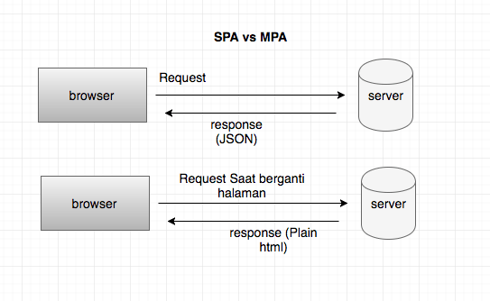

# Single Page Application (SPA)

## Mengenal Apa Itu Single Page Application (SPA)

*Single Page Application (SPA)* adalah salah satu jenis aplikasi *website* di mana hanya ada 1 halaman yang meng-*handle* semua aktivitas yang terjadi dalam aplikasi tersebut.

*User* tidak akan berpindah halaman *browser* ketika melakukan *request* seperti mengisi formulir, klik *link*, atau aksi lain yang membutuhkan data dari *server*.

Semua aksi-aksi tersebut akan di-*handle* secara *Asychronous* oleh *Javascript* (seperti *AJAX*). Perpindahan 1 halaman ke halaman lain di *handle* dengan sistem *routing*, tanpa *loading browser* sehingga prosesnya lebih cepat dan lebih baik di sisi UX-nya.

SPA sangat bergantung pada *utilitas browser* karena menggunakan *javascript* sepenuhnya. Sementara untuk berkomunikasi terhadap *backend* tetap menggunakan *http* *request* terhadap suatu *API/Web services*.

Teknologi SPA berkembang seiring dengan kebutuhan industri pada aplikasi *website* yang dapat bekerja lebih cepat dan hemat *resource* sehingga akan menghemat pengeluaran untuk *server*.

Saat ini, *website* SPA umumnya digunakan pada aplikasi *dashboard* atau aplikasi sejenis yang mana pada satu halaman membutuhkan banyak informasi dan data dari proses bisnis, transaksi, perhitungan, dan sebagainya.

## Single Page Application VS Multi Page Application

Yang membedakan SPA dari *Multi Page Application* (MPA) (kebanyakan website di luar sana), adalah bagaimana SPA melakukan *request* dan *resource*. SPA lebih hemat dibanding dengan MPA. Contohnya, pada saat berpindah ke halaman baru, SPA hanya me-*request* data-data yang diperlukannya saja berupa Javascript Object Notation (JSON), tanpa me-*request* ulang *static files* seperti *file* css, html, dan js nya karena itu sudah di *load* saat pertama kali.

Berbeda dengan MPA yang setiap perpindahan halaman akan me-*request* ulang seluruh elemen baik itu *static files* dan data baru untuk halaman tersebut. Contoh, *website* yang menggunakan SPA antara lain *gmail, facebook, github, techinasia,* dan lain sebagainnya. Untuk MPA contohnya adalah *wikipedia, kaskus, bukalapak,* dan lain-lain.

Mekanisme yang berjalan pada SPA layaknya kita menggunakan *browser* secara *native* dimana secara penuh memanfaatkan perpindahan halaman, *data binding*, *form*, dan lain sebagainya dengan menggunakan *javascript*. Tidak ada waktu menunggu saat terjadi perpindahan halaman. Hal seperti ini memberikan *User Experience* (UX) yang luar biasa kepada *user*.

## Perlukah Website Kita Menggunakan SPA

Jawabannya, tergantung kebutuhan. Karena bagaimanapun SPA memiliki kekurangan dan ketidak-cocokan pada sistem-sistem tertentu. Selengkapnya, akan saya jelaskan pada daftar keuntungan dan kekurangan *Single Page Application* di bawah ini.

### Keuntungan Single Page Application

1. Lebih cepat dibandingkan dengan *multi page application*.

    Kebanyakan *resource* seperti HTML, CSS, dan JS di-*load* pada saat pertama kali aplikasi dibuka dan akan berfungsi terus sampai aplikasi ditutup. Perpindahan halaman tidak perlu melakukan *request* keseluruhan elemen halaman, tetapi hanya data tertentu saja yang belum di *request* saat inisiasi pertama kali. Ada konsep *“virtual DOM”* di mana perubahan pada DOM hanya terjadi pada elemen yang berubah. Sedangkan pada *Multi Page Application*, DOM akan diperbarui secara menyeluruh karena perpindahan halaman harus melakukan *request* kepada *server* dan *server* memberikan *respond* berupa html.

2. Tidak perlu men-*setup* *“server”*.

    SPA hanya memiliki satu buah `index.html`, beberapa css, dan beberapa *javascript*. Sehingga kita cukup drag `index.html` terebut untuk menjalankan aplikasi SPA. Namun tentunnya ini sangat *basic*. Kita tetap membutuhkan *server* jika ingin mengoptimasi performa dari SPA itu sendiri.

3. Proses *debug* sangat mudah, cukup dengan menggunakan *browser (console)*.

    Jika terjadi *error* cukup *refresh* pada *browser* maka akan tampil *error*-nya di *console* tidak perlu melalui proses *compile*. Pada SPA *compile* akan dilakukan di akhir saat seluruh aplikasi telah selesai dikerjakan *(build)* dengan menggunakan *webpack* dan *babel* (untuk *transpile*) untuk menghasilkan `index.html`, *file-file* css, serta *file-file* *javascript* yang telah digabungkan menjadi satu.

4. Satu kode untuk berbagai macam *platform*.

    Dengan *javascript* kita dapat membuat *website, desktop, android, iOS,* bahkan *Windows phone*. Terdapat beberapa *framework* untuk membangun *mobile apps* dengan *javascript* antara lain *react native* dan *ionic*(berbasiskan *angular*).

5. Prosess *caching* lebih efektif karena memanfaatkan *local storage* pada *browser*.

    Sebuah aplikasi dapat mengirim hanya 1 *request*, lalu responnya disimpan dalam *local storage* sehingga dapat digunakan kembali bahkan dalam keadaan *offline* sekalipun.

### Kekurangan Single Page Application

1. Tidak bagus dalam hal SEO.

    Optimasi SEO pada SPA sangat sulit dilakukan karena sejatinya hanya ada 1 halaman yang bisa di-*index* oleh mesin pencari, serumit dan sebanyak apapun data dari aplikasi tersebut. *Route* pada SPA tidak bisa dijadikan sebagai URL yang bisa di-*index* pada mesin pencari. Saat ini, mulai dikembangkan *tools* SPA untuk keperluan SEO. Metodenya adalah mem-*build* SPA secara *server-side* sehingga setiap *route* yang dihasilkan akan menjadi URL. Contoh *tools* ini adalah *Angular Universal* dan *Server-side Rendering* pada *VueJS*

2. Berat saat di-*load*/buka pertama kali.

    SPA me-*request* kebanyakan *resource*-nya saat pertama kali aplikasi dibuka. Hal ini pastinya menyebabkan *loading* yang sangat lama.

3. Sangat bergantung pada *Javascript*.

    Semua aksi dalam SPA menggunakan *javascript*, sehingga ketika *javascript* di *browser* dimatikan oleh *user* aplikasi tidak akan berjalan sama sekali.

4. Kurang aman dibanding dengan *Website* biasa.

    SPA rawan terhadap serangan *Cross-site Scripting (XSS)*, yang memungkinan *hacker* me-*inject script client-side (Javascript)* pada aplikasi.

5. Masalah kompabilitas *browser*.

    Karena SPA mengandalkan *javascript* dan *browser*, ketidakcocokan antaran *browser* satu dan lainnya lebih beresiko terjadi. Ini bisa disebabkan karena *user* menggunakan *browser* lama, perbedaan versi *javascript* pada *browser* yang berbeda, dan sebagainya.

Jadi, bisa disimpulkan bahwa SPA tidak cocok untuk *website-website* yang membutuhkan SEO yang bagus, seperti *blog*. Tetapi, SPA cocok untuk aplikasi *website* seperti *dashboard*, *situs media sosial*, dan sejenisnya.

Sumber: [https://www.devaradise.com/id/2018/06/mengenal-apa-itu-single-page-application.html](https://www.devaradise.com/id/2018/06/mengenal-apa-itu-single-page-application.html)
