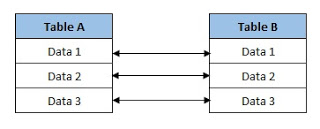
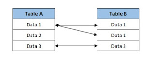
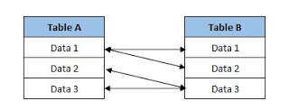

# RDBMS (Relational Database Management System)

RDBMS adalah kependekan dari *Relational Database Management System*. RDBMS adalah program yang melayani sistem basis data yang entitas utamanya terdiri dari **tabel-tabel yang mempunyai relasi dari satu tabel ke tabel yang lain**.

**Suatu *database* terdiri dari banyak tabel. Tabel ini terdiri dari banyak *field* yang merupakan kolomnya. Isi tiap baris dari tabel inilah merupakan data.**

Untuk membuat sistem basis data yang terintegrasi maka antara satu tabel dengan tabel lain mempunyai hubungan yang harus selalu diperlihara. **Setiap tabel mempunyai sebuah *primary key*, *primary key* ini kemudian dihubungkan dengan tabel kedua dan menjadi *foreign key* untuk tabel kedua ini.** Pembuatan *primary key* harus unik, artinya *primary key* baris pertama dengan *primary key* baris ke dua harus berbeda, dan begitu seterusnya.

Dengan *relational database* ini maka data akan secara konsisten disimpan di suatu tabel, kemudian tabel lain yang membutuhkan data lainnya tinggal menghubungkan melalui *foreign key*, dan menggunakan datanya.

Sebagai contoh adalah *database* kampus yang terdiri **tabel_mahasiswa**, **tabel_makakuliah**, dan **nilai**.

*Field* dari **tabel_mahasiswa** adalah `NIM`, `nama`, `alamat`, `tanggal lahir` dengan ***primary_key*** `NIM`.

*Field* dari **tabel_matakuliah** adalah `kode_matakuliah`, `nama_matakuliah`, `sks` dengan ***primary_key*** `kode_matakuliah`.

Untuk tabel **nilai** kita hanya perlu *field* `NIM`, `kode_matakuliah`, dan `nilai`. Di sini `NIM` dan `kode_matakuliah` merupakan ***foreign_key*** untuk tabel **tabel_mahasiswa** dan **tabel_matakuliah**.

Berbagai macam relasi dalam *database:*

1. *one to one*
2. *one to many*
3. *many to many*

## 1. One to One

Relasi *one to one* seperti di atas. Dengan kata lain, relasi *one to one* terjadi **jika ada data pada tabel A yang juga ada di tabel B sehingga mereka akan membentuk relasi**. Contoh:

- Tabel Mahasiswa

    | nim | nama | alamat | id_orangtua |
    |-----|------|--------|-------------|
    | 1   | A    | JKT    | 1           |
    | 2   | B    | JKT    | 2           |
    | 3   | C    | JKT    | 3           |

- Tabel Orang Tua

    | id_orangtua | nama | umur |
    |-------------|------|------|
    | 1           | X    | 50   |
    | 2           | Y    | 60   |
    | 3           | Z    | 60   |

Penjelasan:

Bisa dilihat bahwa 1 mahasiswa hanya memiliki 1 `id_orangtua` saja. Jadi, 1 mahasiswa ya 1 orang tua. Tidak mungkin ada 2 atau lebih mahasiswa yang memiliki 1 orang tua (kecuali jika saudara, tapi dalam kasus ini tidak ada saudara sama sekali).

Perlu diketahui, *primary key* pada **tabel mahasiswa** adalah `nim`. *Foreign key*-nya `id_orangtua`.

*Primary key* pada **tabel orangtua** adalah `id_orangtua` yang menjadi *foreign key* di tabel mahasiswa.

## 2. One to Many

Relasi *one to many* adalah relasi yang terjadi di mana data pada **tabel A mempunyai lebih dari 1 data yang sama pada tabel B**. Contoh:

- Tabel Mahasiswa

    | nim | nama | alamat | id_dosen |
    |-----|------|--------|----------|
    | 1   | A    | JKT    | 1        |
    | 2   | B    | JKT    | 2        |
    | 3   | C    | JKT    | 1        |

- Tabel Dosen

    | id_dosen | nama | umur |
    |----------|------|------|
    | 1        | X    | 50   |
    | 2        | Y    | 60   |

Penjelasan:

Dari tabel di atas bisa dilihat bahwa 1 dosen bisa memiliki lebih dari 1 mahasiswa. Seperti kita lihat mahasiswa dengan `nim` `1` dan `3` memiliki `id_dosen` `1`. Nah, itulah yang disebut dengan relasi *one to many* atau *many to one*.

## 3. Many to Many

Relasi *many to many* adalah relasi di mana **lebih dari 1 data pada tabel A bisa berelasi dengan lebih dari 1 data pada tabel B**. Contoh:

- Tabel Mahasiswa

    | nim | nama | alamat | id_matkul |
    |-----|------|--------|-----------|
    | 1   | A    | JKT    | 1         |
    | 1   | A    | JKT    | 2         |
    | 2   | B    | JKT    | 2         |
    | 2   | B    | JKT    | 1         |

- Tabel Matkul

    | id_matkul | nama_matkul | sks | harga  |
    |-----------|-------------|-----|--------|
    | 1         | basis data  | 3   | 450000 |
    | 2         | keamanan    | 3   | 450000 |

Penjelasan:

Dari 2 tabel tersebut bisa kita lihat bahwa 1 mahasiswa bisa mengambil lebih dari 1 matkul. Sedangkan 1 matkul bisa diambil oleh lebih dari 1 mahasiswa. Jadi itulah yang disebut dengan *many to many*.

---------

RDBMS akan menjaga agar data-data yang menjadi kunci relasi (*foreign_key* dan *primary_key*) ini merupakan data-data yang benar-benar berkaitan satu dengan yang lain. Jika ada data yang salah relasinya, maka RDMBS akan menolak data tersebut. Ini akan memudahkan pembuat program *(software developer)* dalam melakukan *coding* karena dibantu pengecekan secara otomatis oleh RDBMS.

sumber:

1. [https://www.proweb.co.id/articles/web_application/rdbms.html](https://www.proweb.co.id/articles/web_application/rdbms.html)
2. [https://komputer67.blogspot.com/2017/09/relasi-tabel-database.html](https://komputer67.blogspot.com/2017/09/relasi-tabel-database.html)
