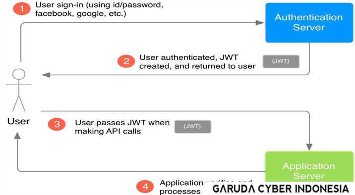

# JWT

Apa itu JWT?

Satu hal yang sangat perlu di perhatikan ketika membuat REST API adalah *security*-nya. Jangan sampai *user* yang tidak memiliki otentikasi dan otorisasi dapat menggunakan REST API yang kita sediakan. Makadari itu kita memerlukan JWT, yaitu *Json Web Token*. *Json Web Token* adalah cara untuk mengautentikasi REST API, sehingga hanya orang yang memiliki token saja yang boleh menggunakannya REST API kita.

